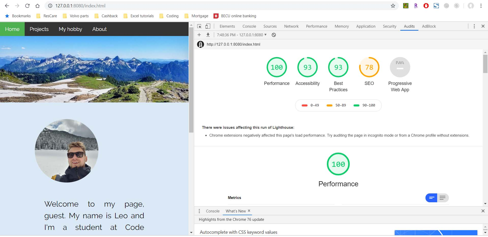

# 201-lab02
## Welcome to my Code Fellows 201 Lab 02 project

### Short features description:
- on the main page you can enter user name in the top right corner (unfortunately it won't be saved after you refresh the page);
- if you want to find out more facts about me you can play a funny question game. To do that just click on "play" button and follow the prompts;
- if the checkbox is checked the questions will be asked in random order;
- all questions and answers are stored in an array of objects. if a new questions added to the array, the random iteration and indexes will work just fine, some of the messages still need to be adjusted, though, so that they only show relevant to the question info);

### Here's a screenshot of Google Audits tool

Thanks to [www.w3schools.com](https://www.w3schools.com/) for the js [random](https://www.w3schools.com/js/js_random.asp) and [css nav bar](https://www.w3schools.com/howto/howto_css_dropdown.asp) tutorials

Thanks to [www.geeksforgeeks.org](https://www.geeksforgeeks.org) for the [array.join()](https://www.geeksforgeeks.org/javascript-array-join-method/) and [parseInt()](https://www.geeksforgeeks.org/string-to-integer-in-java-parseint/) methods

Thanks to [www.kirupa.com](https://www.kirupa.com) for the [array shuffle tutorial](https://www.kirupa.com/html5/shuffling_array_js.htm)

Thanks to [To13](https://www.khanacademy.org/profile/epophoney13/) from[www.khanacademy.org/](https://www.khanacademy.org/) for the [parallax tutorial](https://www.khanacademy.org/computer-programming/parallax-scroll-effect-css/6010241287487488)